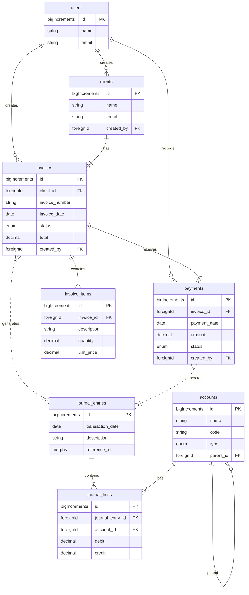

# Invoicing Domain: Database Schema Design

This document outlines the database schema and relationships for the Invoicing domain within the Accounting module of the DuxOne platform.

### 1. Concise Design Overview

This database schema is designed to support a comprehensive invoicing system for the DuxOne platform's Accounting module. The design is centered around the `invoices` table, which is linked to `clients`, `invoice_items`, and `payments`. To ensure compliance with double-entry accounting principles, every financial transaction, including invoice creation and payment, will generate corresponding entries in the `journal_entries` table, which links back to the central `accounts` table.

The structure is optimized for performance and data integrity. Foreign key constraints and indexes are used to maintain relationships and ensure efficient querying, particularly for common operations like fetching invoices by client or date range. Soft deletes are implemented on key entities to allow for data recovery and maintain historical accuracy.

### 2. Database Schema

#### `clients` table
| Column Name | Type | Nullable/Default | Indexes/Foreign Keys | Comments |
| :--- | :--- | :--- | :--- | :--- |
| `id` | `bigIncrements` | - | Primary Key | Unique identifier for the client. |
| `name` | `string` | Not Nullable | - | The client's full name or company name. |
| `email` | `string` | Not Nullable | Unique | The client's primary email address. |
| `phone` | `string` | Nullable | - | The client's contact phone number. |
| `address` | `text` | Nullable | - | The client's billing address. |
| `vat_number` | `string` | Nullable | - | The client's VAT registration number. |
| `created_by` | `foreignId` | Not Nullable | FK to `users.id` | The user who created the client record. |
| `timestamps` | `timestamps` | - | - | `created_at` and `updated_at` timestamps. |
| `deleted_at` | `softDeletes` | - | - | Timestamp for soft deletes. |

#### `invoices` table
| Column Name | Type | Nullable/Default | Indexes/Foreign Keys | Comments |
| :--- | :--- | :--- | :--- | :--- |
| `id` | `bigIncrements` | - | Primary Key | Unique identifier for the invoice. |
| `client_id` | `foreignId` | Not Nullable | FK to `clients.id`, Indexed | The client associated with the invoice. |
| `invoice_number` | `string` | Not Nullable | Unique | A unique, user-facing invoice number. |
| `invoice_date` | `date` | Not Nullable | Indexed | The date the invoice was issued. |
| `due_date` | `date` | Not Nullable | - | The date the payment is due. |
| `status` | `enum` | `draft` | Indexed | `draft`, `sent`, `paid`, `overdue`, `cancelled`. |
| `subtotal` | `decimal(15,2)`| Not Nullable | - | The total amount before taxes. |
| `vat_amount` | `decimal(15,2)`| Not Nullable | - | The total VAT amount (calculated at 15%). |
| `total` | `decimal(15,2)`| Not Nullable | - | The final amount including taxes. |
| `notes` | `text` | Nullable | - | Any additional notes for the client. |
| `created_by` | `foreignId` | Not Nullable | FK to `users.id` | The user who created the invoice. |
| `timestamps` | `timestamps` | - | - | `created_at` and `updated_at` timestamps. |
| `deleted_at` | `softDeletes` | - | - | Timestamp for soft deletes. |
| | | | Compound Index: `(client_id, invoice_date)` | For efficient client and date range queries. |

#### `invoice_items` table
| Column Name | Type | Nullable/Default | Indexes/Foreign Keys | Comments |
| :--- | :--- | :--- | :--- | :--- |
| `id` | `bigIncrements` | - | Primary Key | Unique identifier for the invoice item. |
| `invoice_id` | `foreignId` | Not Nullable | FK to `invoices.id`, Indexed | The invoice this item belongs to. |
| `description` | `string` | Not Nullable | - | A description of the product or service. |
| `quantity` | `decimal(10,2)`| Not Nullable | - | The quantity of the item. |
| `unit_price` | `decimal(15,2)`| Not Nullable | - | The price per unit. |
| `total` | `decimal(15,2)`| Not Nullable | - | The total amount for this line item. |
| `timestamps` | `timestamps` | - | - | `created_at` and `updated_at` timestamps. |

#### `payments` table
| Column Name | Type | Nullable/Default | Indexes/Foreign Keys | Comments |
| :--- | :--- | :--- | :--- | :--- |
| `id` | `bigIncrements` | - | Primary Key | Unique identifier for the payment. |
| `invoice_id` | `foreignId` | Not Nullable | FK to `invoices.id`, Indexed | The invoice this payment is for. |
| `payment_date` | `date` | Not Nullable | - | The date the payment was received. |
| `amount` | `decimal(15,2)`| Not Nullable | - | The amount of the payment. |
| `status` | `enum` | `pending` | Indexed | `pending`, `confirmed`, `failed`. |
| `payment_method`| `string` | Nullable | - | e.g., 'Bank Transfer', 'Credit Card'. |
| `transaction_id`| `string` | Nullable | - | A reference ID for the transaction. |
| `created_by` | `foreignId` | Not Nullable | FK to `users.id` | The user who recorded the payment. |
| `timestamps` | `timestamps` | - | - | `created_at` and `updated_at` timestamps. |
| `deleted_at` | `softDeletes` | - | - | Timestamp for soft deletes. |

#### `journal_entries` table (Header)
| Column Name | Type | Nullable/Default | Indexes/Foreign Keys | Comments |
| :--- | :--- | :--- | :--- | :--- |
| `id` | `bigIncrements` | - | Primary Key | Unique identifier for the journal entry header. |
| `transaction_date`| `date` | Not Nullable | - | The date of the financial transaction. |
| `description` | `string` | Nullable | - | A description of the transaction. |
| `reference_id` | `morphs` | Not Nullable | Polymorphic relation | e.g., `Invoice`, `Payment`. |
| `timestamps` | `timestamps` | - | - | `created_at` and `updated_at` timestamps. |

#### `journal_lines` table (Lines)
| Column Name | Type | Nullable/Default | Indexes/Foreign Keys | Comments |
| :--- | :--- | :--- | :--- | :--- |
| `id` | `bigIncrements` | - | Primary Key | Unique identifier for the journal line. |
| `journal_entry_id` | `foreignId` | Not Nullable | FK to `journal_entries.id`, Indexed | The parent journal entry. |
| `account_id` | `foreignId` | Not Nullable | FK to `accounts.id`, Indexed | The account being debited or credited. |
| `debit` | `decimal(15,2)`| Nullable | - | The debit amount. |
| `credit` | `decimal(15,2)`| Nullable | - | The credit amount. |
| `timestamps` | `timestamps` | - | - | `created_at` and `updated_at` timestamps. |

### 3. ERD (Mermaid Syntax)

### 4. Acceptance Criteria

-   [x] **Support multi-line invoice items**: The `invoice_items` table allows for multiple entries per invoice.
-   [x] **Include VAT (15%)**: The `invoices` table has a dedicated `vat_amount` column.
-   [x] **Track invoice status**: The `invoices` table includes a `status` enum column.
-   [x] **Soft deletes on major entities**: `clients` and `invoices` tables include `deleted_at`.
-   [x] **Track `created_by` (user_id)**: `clients`, `invoices`, and `payments` tables have a `created_by` column.
-   [x] **Efficient queries for invoice listing**: The `invoices` table is indexed on `client_id`, `invoice_date`, and a compound index on `(client_id, invoice_date)`.
-   [x] **Ensure all foreign keys are indexed**: All foreign key columns have been marked for indexing.
-   [x] **Journal entries must support double-entry accounting**: The `journal_entries` table includes `debit`, `credit`, and links to the `accounts` table.

### 5. Files to Create

Based on this refined design, the following migration files will need to be created in the `database/migrations/accounting/` directory:

-   `2025_xx_xx_xxxxxx_create_clients_table.php`
-   `2025_xx_xx_xxxxxx_create_invoices_table.php`
-   `2025_xx_xx_xxxxxx_create_invoice_items_table.php`
-   `2025_xx_xx_xxxxxx_create_payments_table.php`
-   `2025_xx_xx_xxxxxx_create_journal_entries_table.php` (header)
-   `2025_xx_xx_xxxxxx_create_journal_lines_table.php` (lines)
-   `2025_xx_xx_xxxxxx_update_accounts_add_parent_id.php` (add hierarchy)
